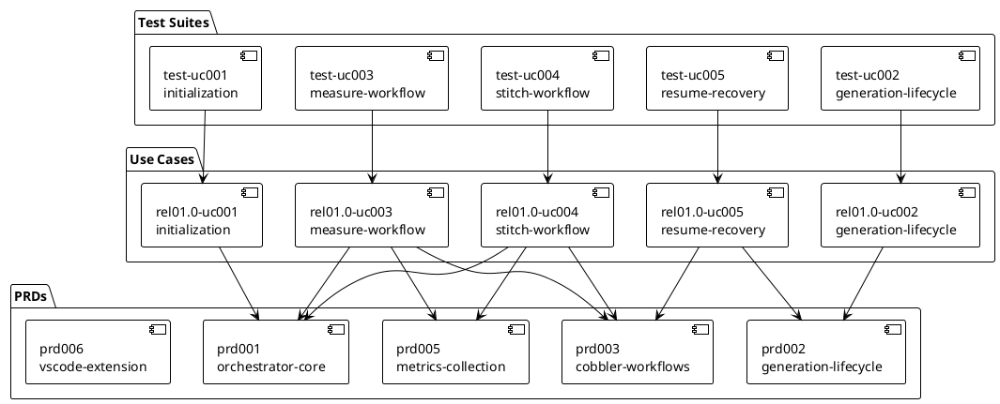

<!-- Copyright (c) 2026 Petar Djukic. All rights reserved. SPDX-License-Identifier: MIT -->

# Specifications

## Overview

We build a Go library that automates AI-driven code generation through a two-phase cobbler workflow: measure proposes tasks, stitch executes them in isolated git worktrees. This document indexes every PRD, use case, and test suite in the project and shows how they trace to each other. For goals and boundaries see [VISION.md](VISION.md). For components and interfaces see [ARCHITECTURE.md](ARCHITECTURE.md).

## Roadmap Summary

Table 1 Roadmap Summary

| Release | Name | Use Cases (done / total) | Status |
|---------|------|--------------------------|--------|
| 01.0 | Core Orchestrator and Workflows | 5 / 5 | done |
| 02.0 | VS Code Extension | 0 / 5 | not started |
| 99.0 | Unscheduled | 0 / 0 | not started |

## PRD Index

Table 2 PRD Index

| PRD | Title | Summary |
|-----|-------|---------|
| [prd001-orchestrator-core](specs/product-requirements/prd001-orchestrator-core.yaml) | Orchestrator Core Interface | Defines the Config struct, constructor, defaults, YAML loading, and initialization for consuming projects |
| [prd002-generation-lifecycle](specs/product-requirements/prd002-generation-lifecycle.yaml) | Generation Lifecycle Management | Defines generation branch naming, start, run, resume, stop, reset, list, and switch operations |
| [prd003-cobbler-workflows](specs/product-requirements/prd003-cobbler-workflows.yaml) | Cobbler Measure and Stitch Workflows | Defines the measure and stitch phases, prompt templates, Claude invocation, and recovery |
| [prd005-metrics-collection](specs/product-requirements/prd005-metrics-collection.yaml) | Metrics Collection and Reporting | Defines InvocationRecord, LOC snapshots, stats collection, and token parsing |
| [prd006-vscode-extension](specs/product-requirements/prd006-vscode-extension.yaml) | VS Code Extension | Defines generation browser, issue tracker, and metrics dashboard for VS Code (not started) |

## Use Case Index

Table 3 Use Case Index

| Use Case | Title | Release | Status | Test Suite |
|----------|-------|---------|--------|------------|
| [rel01.0-uc001](specs/use-cases/rel01.0-uc001-orchestrator-initialization.yaml) | Orchestrator Initialization and Configuration | 01.0 | done | [test-rel01.0-uc001](specs/test-suites/test-rel01.0-uc001-orchestrator-initialization.yaml) |
| [rel01.0-uc002](specs/use-cases/rel01.0-uc002-generation-lifecycle.yaml) | Generation Lifecycle from Start to Stop | 01.0 | done | [test-rel01.0-uc002](specs/test-suites/test-rel01.0-uc002-generation-lifecycle.yaml) |
| [rel01.0-uc003](specs/use-cases/rel01.0-uc003-measure-workflow.yaml) | Measure Workflow Task Proposal | 01.0 | done | [test-rel01.0-uc003](specs/test-suites/test-rel01.0-uc003-measure-workflow.yaml) |
| [rel01.0-uc004](specs/use-cases/rel01.0-uc004-stitch-workflow.yaml) | Stitch Workflow Task Execution | 01.0 | done | [test-rel01.0-uc004](specs/test-suites/test-rel01.0-uc004-stitch-workflow.yaml) |
| [rel01.0-uc005](specs/use-cases/rel01.0-uc005-resume-recovery.yaml) | Generation Resume and Task Recovery | 01.0 | done | [test-rel01.0-uc005](specs/test-suites/test-rel01.0-uc005-resume-recovery.yaml) |

## Test Suite Index

Table 4 Test Suite Index

| Test Suite | Title | Traces | Test Cases |
|------------|-------|--------|------------|
| [test-rel01.0-uc001](specs/test-suites/test-rel01.0-uc001-orchestrator-initialization.yaml) | Orchestrator initialization and configuration | rel01.0-uc001, prd001 | 5 |
| [test-rel01.0-uc002](specs/test-suites/test-rel01.0-uc002-generation-lifecycle.yaml) | Generation lifecycle from start to stop | rel01.0-uc002, prd002 | 7 |
| [test-rel01.0-uc003](specs/test-suites/test-rel01.0-uc003-measure-workflow.yaml) | Measure workflow task proposal | rel01.0-uc003, prd003 | 5 |
| [test-rel01.0-uc004](specs/test-suites/test-rel01.0-uc004-stitch-workflow.yaml) | Stitch workflow task execution | rel01.0-uc004, prd003 | 7 |
| [test-rel01.0-uc005](specs/test-suites/test-rel01.0-uc005-resume-recovery.yaml) | Generation resume and task recovery | rel01.0-uc005, prd002, prd003 | 7 |

## PRD-to-Use-Case Mapping

Table 5 PRD-to-Use-Case Mapping

| Use Case | PRD | Why Required | Coverage |
|----------|-----|--------------|----------|
| [rel01.0-uc001](specs/use-cases/rel01.0-uc001-orchestrator-initialization.yaml) | [prd001-orchestrator-core](specs/product-requirements/prd001-orchestrator-core.yaml) | Validates Config struct, constructor defaults, and Init method | R1, R2, R5 |
| [rel01.0-uc002](specs/use-cases/rel01.0-uc002-generation-lifecycle.yaml) | [prd002-generation-lifecycle](specs/product-requirements/prd002-generation-lifecycle.yaml) | Exercises generation start, run, stop, and list operations | R2, R3, R5, R7 |
| [rel01.0-uc003](specs/use-cases/rel01.0-uc003-measure-workflow.yaml) | [prd001-orchestrator-core](specs/product-requirements/prd001-orchestrator-core.yaml) | Uses Config workflow fields for measure configuration | R1 (partial) |
| [rel01.0-uc003](specs/use-cases/rel01.0-uc003-measure-workflow.yaml) | [prd003-cobbler-workflows](specs/product-requirements/prd003-cobbler-workflows.yaml) | Validates measure phase: prompt rendering, Claude invocation, issue import | R1, R2, R5, R6, R7 |
| [rel01.0-uc003](specs/use-cases/rel01.0-uc003-measure-workflow.yaml) | [prd005-metrics-collection](specs/product-requirements/prd005-metrics-collection.yaml) | Records InvocationRecord on each created issue | R1 (partial) |
| [rel01.0-uc004](specs/use-cases/rel01.0-uc004-stitch-workflow.yaml) | [prd001-orchestrator-core](specs/product-requirements/prd001-orchestrator-core.yaml) | Uses Config workflow fields for stitch configuration | R1 (partial) |
| [rel01.0-uc004](specs/use-cases/rel01.0-uc004-stitch-workflow.yaml) | [prd003-cobbler-workflows](specs/product-requirements/prd003-cobbler-workflows.yaml) | Validates stitch phase: worktree isolation, Claude execution, merge, close | R1, R3, R4, R6 |
| [rel01.0-uc004](specs/use-cases/rel01.0-uc004-stitch-workflow.yaml) | [prd005-metrics-collection](specs/product-requirements/prd005-metrics-collection.yaml) | Records InvocationRecord with LOC snapshots and diff stats | R1, R2, R5 |
| [rel01.0-uc005](specs/use-cases/rel01.0-uc005-resume-recovery.yaml) | [prd002-generation-lifecycle](specs/product-requirements/prd002-generation-lifecycle.yaml) | Exercises resume and branch resolution logic | R4, R9 |
| [rel01.0-uc005](specs/use-cases/rel01.0-uc005-resume-recovery.yaml) | [prd003-cobbler-workflows](specs/product-requirements/prd003-cobbler-workflows.yaml) | Exercises stale task recovery and orphaned issue reset | R4 |

## Traceability Diagram

|  |
|:--:|

|Figure 1 Traceability between PRDs, use cases, and test suites |

## Coverage Gaps

We identify the following gaps in specification coverage.

- prd005-metrics-collection has no dedicated use case. We exercise it indirectly through uc003 (measure) and uc004 (stitch), which record InvocationRecords. A dedicated use case would provide more thorough validation.
- prd006-vscode-extension has no use cases or test suites. This PRD belongs to release 02.0, which has not started. Five use cases are planned in road-map.yaml but their YAML files do not exist yet.
- No prd004 exists. The PRD numbering skips from prd003 to prd005.
- rel02.0 use cases (uc001 through uc005) are listed in road-map.yaml but have no corresponding files in docs/specs/use-cases/.
